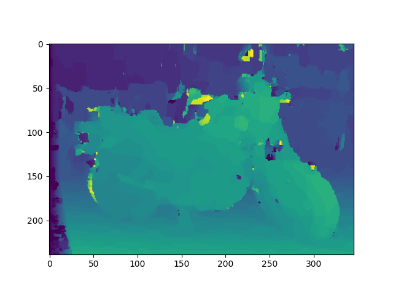
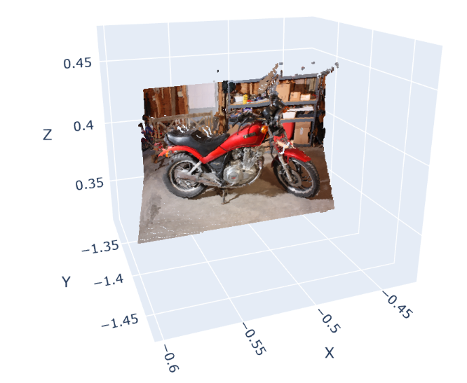

## 3D Reconstruction using Stereo Vision: SAD Disparity and Classical Stereo Triangulation
Author:Dhanush Srinivas
Student ID: 1002232331
Course: CSE 6367 - Computer Vision
University of Texas at Arlington

## Project Overview
This project implements a complete classical stereo vision pipeline to reconstruct 3D geometry from 2D image pairs. We use the 2014 Middlebury Stereo Dataset and rely on Sum of Absolute Differences (SAD) for disparity estimation and classical triangulation for depth recovery.

## Theory
Stereo vision mimics human depth perception. Two cameras separated by a known baseline capture the same scene from different perspectives. The difference in horizontal location (disparity) allows us to calculate depth using:

ini
Copy
Edit
z = f * b / (d + doffs)
Where:

f = focal length

b = baseline (distance between cameras)

d = disparity

doffs = disparity offset

## 🖼️ Sample Output

### Stereo Image Pair
| Left Image | Right Image |
|------------|-------------|
|  |  |

### Disparity Maps
| Raw Disparity | Post-Processed |
|---------------|----------------|
|  |  |

### Final 3D Point Cloud

---

## 📁 Dataset

We used the **“Recycling”** stereo pair from the [2014 Middlebury Stereo Dataset](https://vision.middlebury.edu/stereo/data/). The images are downsampled to `358 × 240` for faster computation. Calibration parameters are extracted from the `calib.txt` file.

---

## ⚙️ Pipeline Overview

- **Preprocessing**: Convert images to grayscale and resize.
- **Disparity Estimation**: Compute disparity via SAD block matching.
- **Post-Processing**: Apply mode filtering, average smoothing, and outlier clipping.
- **Depth Calculation**: Use triangulation formula with calibrated parameters.
- **3D Reconstruction**: Generate point cloud using OpenCV and Open3D.
- **Visualization**: Interactive Plotly rendering.

---

## 📊 Results Summary

- **Points Generated**: ~22,000  
- **SAD Window Size**: 11×11  
- **Disparity Range**: 0–32  
- **Runtime**: ~28 seconds on RTX 4060  
- **PLY File Size**: ~2.3 MB  
- **Resized Input Resolution**: 358 × 240 (1/8th of original)

✅ This classical approach is fast, interpretable, and runs without GPU training or complex models.

---

## ✅ Use Cases

- 🛰 **Field Robotics** – where LiDAR is not feasible  
- 📱 **Edge Devices** – like drones and low-memory boards  
- 🎓 **Education** – to teach depth estimation and triangulation

---

## 🧪 Environment & Tools

| Component         | Version / Spec              |
|------------------|-----------------------------|
| OS               | Windows 11                  |
| IDE              | Visual Studio Code          |
| Python           | 3.11                        |
| CPU              | AMD Ryzen 7                 |
| GPU              | NVIDIA RTX 4060             |
| Libraries Used   | NumPy (1.24), OpenCV (4.8), Pillow (9.5), Open3D (0.18), Plotly (5.14) |

---

## 📎 References

> Full citations available in [`references.bib`](./references.bib)

- [Middlebury Stereo Dataset](https://vision.middlebury.edu/stereo/)
- Howard & Rogers (2012) – *Perceiving in Depth*
- Yang et al. (2024) – *Real-Time Stereo Matching with SAD*
- OpenCV Documentation
- Kytö et al. (2011) – *Triangulation Accuracy in Stereo Vision*

---

## 🔗 GitHub Repository

Explore the code and results:  
👉 [CSE6367 Final Project - 3D Reconstruction using Stereo Vision](https://github.com/Dev-Dhanush-hub/CSE6367_final_project-3D-Reconstruction-using-Stereo-Vision)
